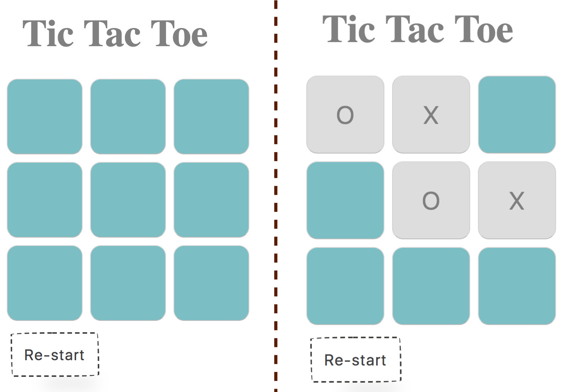

# Tic Tac Toe
https://github.com/makersacademy/course/blob/master/individual_challenges/tic_tac_toe.md  
This Tic Tac Toe app is build using Javascript, jQuery and strictly followed TDD process during the logic development.

## Installation
To install dependencies, clone the repo and run: 
```
npm install -g node@latest --unsafe-perm
``` 

### Usage
Run `open index.html ` to open the app


### Testing and Coverage

#### Unit Test
Unit tests were written in Jasmine v3.3.1 for back-end logic and track coverage with Istanbul.  
To run unit tests and get coverage report, enter:
```
istanbul cover ./node_modules/jasmine/bin/jasmine.js --print detail
```

#### Feature Test
Feature tests were written in TestCafe v0.23.3 for front-end features.  
To run feature test, open the file `feature_cafetest.js` in the spec folder and replace the absolute path to the `index.html` in line 4 after `.page`. Then:
Run feature tests in Chrome, enter: 
```
testcafe chrome ./spec/features_cafetest.js -e
```
To run feature tests in Safari, enter:
```
testcafe safari ./spec/features_cafetest.js -e
```

### Linting
All files in `src` are linted using Eslint.  
To see linting result, enter:
```
./node_modules/.bin/eslint src/Game.js
./node_modules/.bin/eslint src/interface.js
```